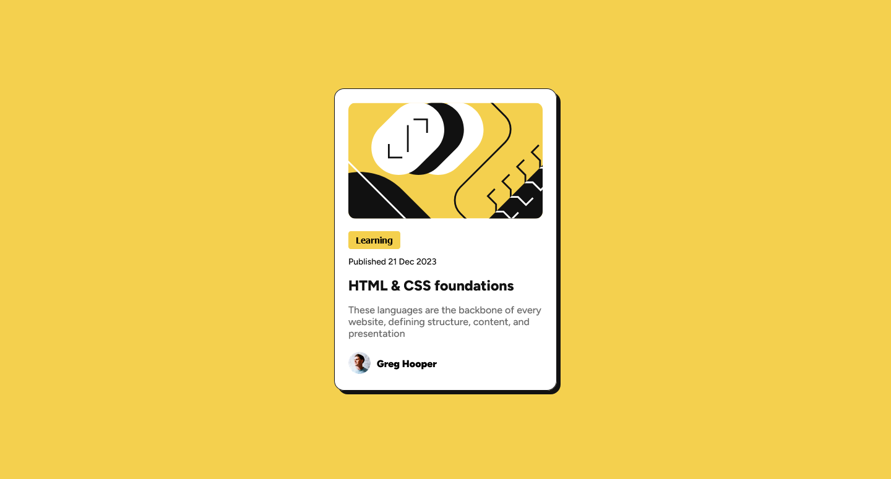

# Frontend Mentor - Blog Preview Card Solution

This is a solution to the [Blog Preview Card challenge on Frontend Mentor](https://www.frontendmentor.io/challenges/blog-preview-card-ckPaj01IcS). Frontend Mentor challenges help you improve your coding skills by building realistic projects.

### Screenshot

### Links

- Solution URL: [Add solution URL here](https://your-solution-url.com)
- Live Site URL: [Add live site URL here](https://your-live-site-url.com)

### What I Learned

Working on this project, I gained insights into:

- **Responsive Design**: Using `clamp()` for responsive font sizes and layout dimensions, improving design adaptability across different devices.
- **CSS Custom Properties**: Leveraging variables for color management, which simplifies theme updates and maintains consistency.

## Author

- Website - [Your Website](https://www.your-site.com)
- Frontend Mentor - [@punitkotian](https://www.frontendmentor.io/profile/punitkotian)

