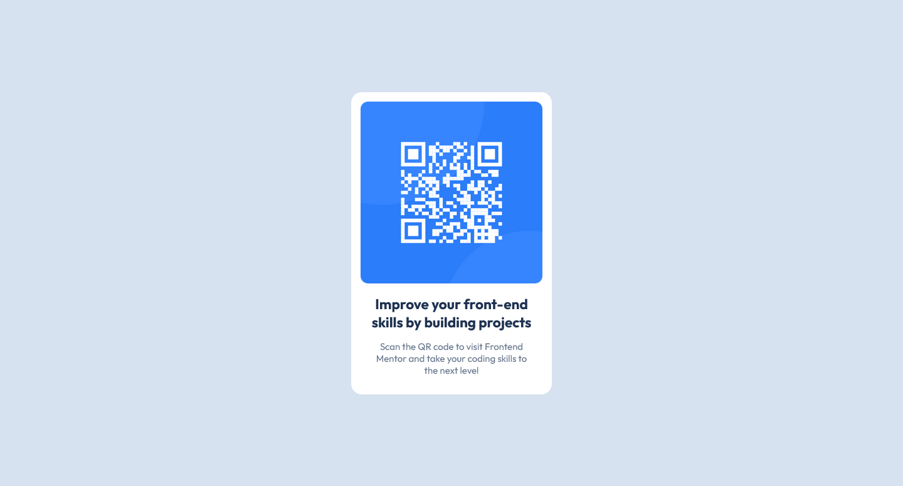

# Frontend Mentor - QR code component solution

This is my solution to the [QR code component challenge on Frontend Mentor](https://www.frontendmentor.io/challenges/qr-code-component-iux_sIO_H). This challenge helped me improve my HTML and CSS skills by working on a realistic project.

## Table of contents

- [Overview](#overview)
  - [Screenshot](#screenshot)
  - [Links](#links)
- [My process](#my-process)
  - [Built with](#built-with)
  - [What I learned](#what-i-learned)
  - [Continued development](#continued-development)
  - [Useful resources](#useful-resources)
- [Author](#author)

## Overview

### Screenshot



### Links

- [Solution URL](#) <!-- Add solution URL -->
- [Live Site URL](#) <!-- Add live site URL -->

## My process

### Built with

- Semantic HTML5 markup
- CSS custom properties
- Flexbox for layout
- Desktop-first workflow
- Google Fonts for custom typography

### What I learned

During this project, I improved my ability to work with **flexbox** for centering elements on a page. Additionally, I worked with **CSS custom properties** to maintain a consistent color scheme and better readability.

Here's an example of the `container` styling I used:

```css
.container {
  width: 320px;
  background-color: hsl(0, 0%, 100%);
  border-radius: 17px;
  padding: 15px;
}
```

I also experimented with font integration using Google Fonts:

```css
body {
  font-family: "Outfit", sans-serif;
  font-size: 15px;
}
```

### Continued development

In future projects, I want to dive deeper into responsive design, making sure my layouts look perfect on all screen sizes. I also plan to further explore modern CSS layout techniques such as **CSS Grid**.

### Useful resources

- [CSS Tricks - A Complete Guide to Flexbox](https://css-tricks.com/snippets/css/a-guide-to-flexbox/) - This guide helped me better understand flexbox for positioning the elements centrally.
- [Google Fonts](https://fonts.google.com/) - I used the Outfit font for this project, and Google Fonts provided easy integration into my CSS.

## Author

- Frontend Mentor - [@punitkotian](https://www.frontendmentor.io/profile/punitkotian)

---
