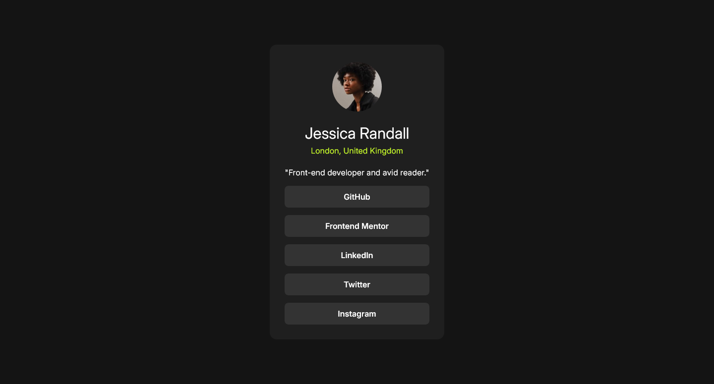

# Frontend Mentor - Social links profile solution

This is a solution to the [Social links profile challenge on Frontend Mentor](https://www.frontendmentor.io/challenges/social-links-profile-UG32l9m6dQ). Frontend Mentor challenges help you improve your coding skills by building realistic projects. 

### Screenshot

### Links

- [Solution URL: ](https://github.com/punitkotian/Frontend-Mentor/tree/main/social-links-profile-main)
- [Live Site URL: ](https://66edb0e033a5bb2fea3d3816--cerulean-marzipan-a625f0.netlify.app/)

### Built with

- Semantic HTML5 markup
- CSS custom properties

### What I learned

In this project, I learned how to create and use custom CSS variables effectively. I also experimented with implementing the BEM (Block, Element, Modifier) methodology for naming classes, which helped me keep the code more structured and modular. Additionally, I started exploring responsive typography using fluid fonts, though I still have room for improvement in this area. I'm actively working to get better at it!

### Continued development

Going forward, I want to focus more on making my designs work well on different screen sizes. I also want to get better at creating layouts that adjust smoothly and improve accessibility for all users.

### Useful resources

- [Example resource 1](https://utopia.fyi/) - This resource helped me understand how to create fluid typography and spacing, which adjusts dynamically across different screen sizes.

## Acknowledgments
I’d like to thank Steven Stroud (@Stroudy) for recommending the use of semantic HTML and best practices. His advice on implementing BEM methodology was invaluable. He also shared great resources that helped me understand responsive design better.